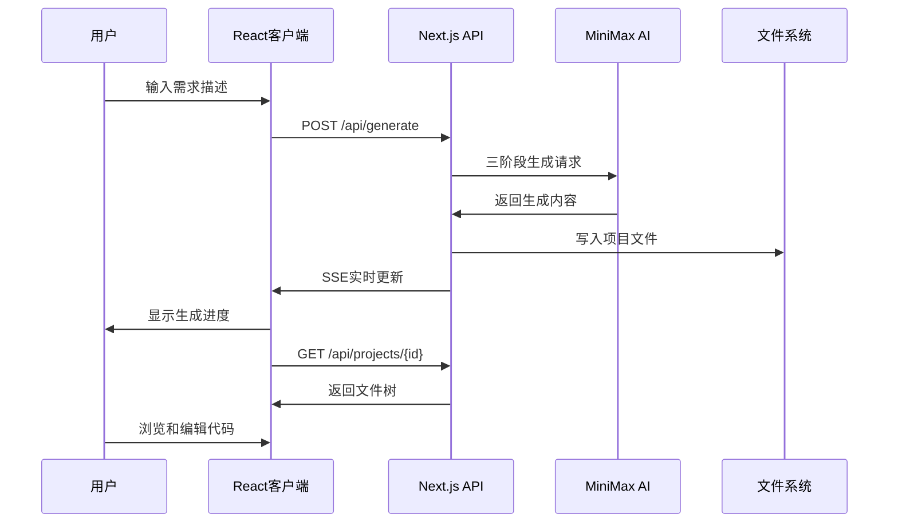

# 🚀 **SpecKit** - 基于前后端分离的AI编程工作台

> **基于Spec-Driven Development的AI代码生成平台**
---

## 2 🙋‍♀️ 这个项目是什么？（Spec-Driven Development的中文实践）

**本项目基于GitHub Spec-Kit框架，感谢 @localden @jflam 的开创性工作。这是Spec-Driven Development在中文社区的首个完整案例。**

**"输入需求描述，AI自动生成完整的Python应用。"**

这个项目基于 **Spec-Driven Development理念**：将软件开发从代码编写转向规范驱动，通过前后端分离架构，实现AI引擎对规范的智能解析和代码生成。

**核心理念：**
- **规范即代码**：清晰的规范自动生成完整可运行的软件
- **前后端分离**：React前端 + Next.js后端，专注高效的开发模式
- **AI引擎驱动**：MiniMax AI引擎，专注规范到代码的智能转换

这个项目的目标是：**让非程序员也能通过自然语言描述需求，获得完整的、可运行的Python应用。**

**我的贡献是工程化实现和推广叙事**：将理论框架转化为可运行的系统，验证了医学生通过AI也能做全栈开发。

**核心特性：**
- 🎯 **实时代码生成**：MiniMax AI引擎驱动的三阶段生成（指定→计划→实现）
- 🤖 **前后端分离架构**：React客户端 + Next.js API服务器
- 📊 **实时工作台**：Server-Sent Events实时显示生成进度
- 🔧 **项目管理系统**：UUID-based的项目存储和文件服务

---


---

## 5 🏗️ **系统架构**

### 5.1 整体架构图

```
┌─────────────────┐    HTTP/WebSocket    ┌─────────────────┐
│   React Client  │◄──────────────────►│  Next.js Server │
│   (ui-client/)  │                     │  (frontend/)    │
│                 │                     │                 │
│ • 着陆页        │                     │ • API路由       │
│ • 工作台        │◄────SSE流──────────►│ • SSE流服务     │
│ • 文件浏览器   │                     │ • 文件服务      │
│ • 代码编辑器   │                     │ • MiniMax集成   │
└─────────────────┘                     └─────────────────┘
        ▲                                       ▲
        │                                       │
        └──────────────projects/──────────────┘
                        文件存储
```

### 5.2 技术栈

#### 前端客户端 (ui-client/)
```json
{
  "framework": "React 19 + TypeScript",
  "build_tool": "Vite 6",
  "styling": "Tailwind CSS",
  "animations": "Framer Motion",
  "state_management": "React Hooks",
  "runtime": "Node.js 22+"
}
```

#### 后端API服务器 (frontend/)
```json
{
  "framework": "Next.js 14 (App Router)",
  "runtime": "Node.js 22+ (LTS)",
  "ai_engine": "MiniMax API",
  "streaming": "Server-Sent Events",
  "file_system": "Node.js fs + path",
  "parsing": "Regex-based code parsing",
  "architecture": "API Routes only (no pages)"
}
```

### 5.3 核心目录结构

```
speclite_rebuild/
├── ui-client/              # React前端客户端
│   ├── components/         # React组件
│   │   ├── LandingView.tsx # 着陆页
│   │   ├── WorkbenchView.tsx # 工作台
│   │   └── ...
│   ├── App.tsx            # 主应用组件
│   ├── types.ts           # TypeScript类型定义
│   └── package.json       # 前端依赖
│
├── frontend/               # Next.js后端API服务器
│   ├── src/
│   │   ├── app/
│   │   │   ├── api/        # API路由
│   │   │   │   ├── generate/ # 代码生成API
│   │   │   │   ├── stream/   # SSE流服务
│   │   │   │   └── projects/ # 项目文件服务
│   │   │   └── page.tsx     # 简单的状态页
│   │   └── lib/            # 业务逻辑库
│   │       ├── minimax.ts   # MiniMax AI客户端
│   │       ├── parser.ts    # 代码解析器
│   │       ├── prompts.ts   # 生成提示模板
│   │       └── ...
│   └── package.json        # 后端依赖
│
├── projects/               # 生成的项目存储
│   ├── {uuid}/            # 每个项目独立的目录
│   │   ├── main.py        # 生成的主文件
│   │   ├── requirements.txt # 依赖文件
│   │   ├── README.md      # 项目文档
│   │   └── ...
│   └── ...
│
├── specs/                  # 规格文档
│   └── 001-realtime-workbench/ # 当前功能规格
│       ├── spec.md         # 需求规格
│       ├── plan.md         # 实现计划
│       ├── tasks.md        # 任务清单
│       └── contracts/      # API契约
│
└── scripts/                # 开发工具脚本
    ├── complete-test-runner.ps1
    ├── test_streaming.py
    └── ...
```

---

## 6 🔄 **工作流程**

### 6.1 用户体验流程



### 6.2 技术实现流程

1. **需求输入阶段**
   - 用户在React客户端输入自然语言需求
   - 客户端生成UUID作为项目标识

2. **生成触发阶段**
   - React客户端调用Next.js的`/api/generate`接口
   - Next.js服务器立即返回，开始异步生成
   - 客户端自动跳转到工作台界面

3. **AI生成阶段**
   - Next.js后端调用MiniMax API进行三阶段生成：
     - **指定阶段**：分析需求，制定技术规格
     - **计划阶段**：制定详细的实现计划
     - **实现阶段**：生成具体的代码文件

4. **实时反馈阶段**
   - 通过Server-Sent Events (SSE)实时推送生成进度
   - 文件创建时立即在工作台中显示
   - 支持分块内容更新，提升用户体验

5. **项目管理阶段**
   - 生成的项目存储在`projects/{uuid}/`目录
   - Next.js提供文件浏览和下载API
   - 支持项目历史记录和状态管理

---

## 7 ⚙️ **核心功能**

### 7.1 AI驱动的代码生成

- **三阶段生成流程**：
  - 📋 **指定 (Specify)**：需求分析和技术规格制定
  - 🎯 **计划 (Plan)**：详细实现计划和架构设计
  - 💻 **实现 (Implement)**：实际代码文件生成

- **智能解析**：基于正则表达式的代码块解析
- **多语言支持**：专注于Python应用生成
- **依赖管理**：自动生成requirements.txt

### 7.2 实时工作台体验

- **Server-Sent Events**：实时显示生成进度
- **文件树浏览器**：动态更新的项目结构视图
- **代码编辑器**：内置代码查看和编辑功能
- **状态管理**：生成进度和连接状态指示

### 7.3 项目管理系统

- **UUID-based存储**：每个项目独立的目录结构
- **文件服务API**：完整的项目文件访问接口
- **原子文件写入**：确保文件完整性
- **跨平台兼容**：Windows路径处理优化

---

## 8 🚀 **快速开始**

### 8.1 环境要求

- **Node.js**: 22.0.0+
- **操作系统**: Windows 10/11 (已优化)
- **内存**: 至少4GB可用内存
- **网络**: 稳定的互联网连接 (MiniMax API)

### 8.2 安装步骤

1. **克隆项目**
```bash
git clone <repository-url>
cd speclite_rebuild
```

2. **安装前端依赖**
```bash
cd ui-client
npm install
```

3. **安装后端依赖**
```bash
cd ../frontend
npm install
```

4. **配置环境变量**
```bash
# 在frontend目录创建.env.local
cp .env.example .env.local

# 编辑环境变量
MINIMAX_API_KEY=your-api-key
MINIMAX_GROUP_ID=your-group-id
PROJECTS_ROOT=../projects
```

5. **启动开发服务器**
```bash
# 启动前端客户端 (端口3001)
cd ui-client
npm run dev

# 启动后端API服务器 (端口3000)
cd ../frontend
npm run dev
```

### 8.3 使用方法

1. **访问应用**
   - 前端客户端: http://localhost:3001
   - 后端API: http://localhost:3000

2. **生成项目**
   - 在输入框中描述你想要的应用
   - 点击"开始生成"
   - 实时观看代码生成过程

3. **浏览项目**
   - 生成完成后在工作台中浏览文件
   - 查看生成的代码和文档
   - 下载或进一步编辑

---

## 9 🔧 **开发指南**

### 9.1 前端开发 (ui-client)

```bash
cd ui-client
npm run dev          # 启动开发服务器
npm run build        # 构建生产版本
npm run preview      # 预览生产版本
```

### 9.2 后端开发 (frontend)

```bash
cd frontend
npm run dev          # 启动Next.js开发服务器
npm run build        # 构建生产版本
npm run start        # 启动生产服务器
npm run lint         # 代码检查
```

### 9.3 测试运行

```bash
# 运行前端测试
cd ui-client
npm run test

# 运行后端测试
cd ../frontend
npm run test

# 运行集成测试
cd scripts
./complete-test-runner.ps1
```

---

## 10 📊 **API 接口**

### 10.1 代码生成API

**POST /api/generate**
```typescript
interface GenerateRequest {
  prompt: string;      // 用户需求描述
  projectId: string;   // 项目UUID
}

interface GenerateResponse {
  status: 'started';   // 立即返回，开始异步生成
}
```

### 10.2 实时流API

**GET /api/stream/{projectId}**
```typescript
// Server-Sent Events 流
interface SSEEvent {
  event: 'phase_start' | 'phase_complete' | 'file_created' | 'generation_complete';
  data: {
    project_id: string;
    phase?: string;
    filename?: string;
    content?: string;
    // ... 其他字段
  };
}
```

### 10.3 项目文件API

**GET /api/projects/{projectId}**
```typescript
interface ProjectResponse {
  id: string;
  files: FileNode[];
  structure: DirectoryTree;
}
```

---

## 11 🎯 **项目特色**

### 11.1 Speckit思想的体现

- **规范驱动**：从需求描述直接生成可运行代码
- **前后端分离**：清晰的职责划分和独立部署
- **AI优先**：将AI作为核心生产力工具

### 11.2 用户体验创新

- **实时反馈**：生成过程完全透明
- **无等待体验**：立即跳转工作台，无空白等待
- **沉浸式交互**：文件创建实时可视化

### 11.3 技术创新

- **流式生成**：基于SSE的实时内容更新
- **智能解析**：正则表达式驱动的代码解析
- **原子操作**：文件写入的完整性保证

---

## 12 📈 **性能特性**

- **生成速度**：平均30-60秒完成项目生成
- **实时更新**：文件创建延迟小于1秒
- **内存优化**：分块内容更新，控制内存使用
- **并发处理**：支持多项目同时生成

---

## 13 🔒 **安全考虑**

- **API密钥保护**：服务端环境变量存储
- **文件系统隔离**：项目目录UUID隔离
- **输入验证**：严格的请求参数校验
- **错误处理**：用户友好的错误信息

---

## 14 📚 **相关文档**

- [API参考文档](docs/API_REFERENCE.md)
- [更新日志](docs/CHANGELOG.md)

---

## 15 🤝 **贡献**

欢迎提交Issue和Pull Request！

**开发原则：**
- 保持前后端分离的架构清晰性
- 优先考虑用户体验
- 遵循Speckit规范驱动的思想

---

## 16 📄 **许可证**

本项目采用 MIT 许可证。

---

*"让AI帮你写代码，专注于创造"* 🚀
